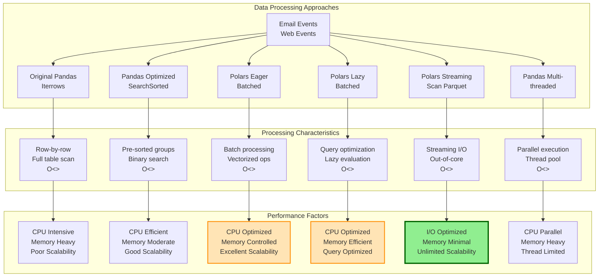

# Web Feature Calculation Benchmark

This benchmark compares different implementations for calculating web events that occur within 5 minutes of email marketing events for the same user ID.

## Problem Description

Given:

- **Email Events**: A dataset with `EVENT_ID`, `USER_ID`, and `FIRST_EVENT_TIMESTAMP`
- **Web Events**: A dataset with `USER_ID` and `FIRST_EVENT_TIMESTAMP`

**Goal**: For each email event, count how many web events occurred within the next 5 minutes for the same user ID.

## Implementation Approaches

### 1. Original Pandas (Iterrows)

- **Approach**: Iterates through each email row using `iterrows()`
- **Lookup**: Filters entire web events DataFrame for each row
- **Time Complexity**: O(n × m) where n = email rows, m = web events
- **Memory**: Loads entire datasets in memory

### 2. Pandas Optimized (SearchSorted)

- **Approach**: Pre-processes web events by sorting and grouping by user ID
- **Lookup**: Uses `searchsorted()` for efficient binary search within time windows
- **Time Complexity**: O(n log m) after O(m log m) preprocessing
- **Memory**: Creates lookup dictionary for grouped web events

### 3. Polars Eager Batched

- **Approach**: Processes data in batches using Polars eager evaluation
- **Lookup**: Joins and filters using Polars vectorized operations
- **Time Complexity**: O(n + m) per batch with efficient columnar operations
- **Memory**: Processes data in configurable batch sizes

### 4. Polars Lazy Batched

- **Approach**: Similar to eager but uses lazy evaluation for query optimization
- **Lookup**: Polars query optimizer optimizes the execution plan
- **Time Complexity**: O(n + m) per batch with query optimization
- **Memory**: Deferred execution allows for memory optimization

### 5. Polars Streaming (Scan Parquet)

- **Approach**: Streams web events from disk using Parquet format
- **Lookup**: Leverages Polars streaming engine for out-of-core processing
- **Time Complexity**: O(n + m) with streaming I/O optimization
- **Memory**: Minimal memory footprint, processes data as streams

### 6. Pandas Multithreaded

- **Approach**: Parallelizes the original iterrows approach using ThreadPoolExecutor
- **Lookup**: Same filtering as original but across multiple threads
- **Time Complexity**: O(n × m / t) where t = number of threads
- **Memory**: Multiple thread contexts but same per-thread memory usage

## Architecture Comparison



## Expected Performance Ranking

Based on algorithmic complexity and modern data processing principles:

### 🥇 **Winner: Polars Streaming**

**Why it's fastest:**

- **Streaming I/O**: Processes data without loading everything into memory
- **Columnar Processing**: Polars uses Apache Arrow for ultra-fast columnar operations
- **Query Optimization**: Advanced query planner optimizes execution automatically
- **Parallel Execution**: Polars leverages all CPU cores by default
- **Memory Efficiency**: Constant memory usage regardless of data size
- **Modern Architecture**: Built from the ground up for performance

### 🥈 **Runner-up: Polars Lazy/Eager Batched**

**Strengths:**

- Vectorized operations are much faster than row-by-row processing
- Batch processing controls memory usage
- Polars' columnar format is inherently faster than Pandas' row-based approach
- Multi-threading built into Polars operations

### 🥉 **Third: Pandas Optimized (SearchSorted)**

**Strengths:**

- Binary search reduces lookup time from O(m) to O(log m)
- Pre-sorting eliminates redundant work
- Much more efficient than naive approaches

## Key Performance Factors

### Why Polars Outperforms Pandas:

1. **Memory Layout**:

   - Polars uses columnar memory layout (Apache Arrow)
   - Better cache locality and SIMD vectorization
   - Pandas uses row-based layout with higher memory overhead

2. **Query Optimization**:

   - Polars has a sophisticated query optimizer
   - Automatically parallelizes operations
   - Predicate pushdown and projection pushdown optimizations

3. **Rust Implementation**:

   - Polars core is written in Rust (zero-cost abstractions)
   - Pandas relies on C extensions with Python overhead

4. **Streaming Capabilities**:

   - Polars can process datasets larger than RAM
   - Pandas requires everything to fit in memory

5. **Parallel by Default**:
   - Polars automatically uses all CPU cores
   - Pandas operations are mostly single-threaded

## Running the Benchmark

```bash
python benchmark.py
```

The script creates synthetic data and runs each implementation multiple times to get accurate performance measurements.

## Sample Data

- **Email Events**: 10,000 rows with EVENT_ID, USER_ID, and timestamps
- **Web Events**: 50,000 rows with USER_ID and timestamps
- **Time Window**: 5-minute window for matching events
- **Runs**: 10 iterations per implementation for statistical significance

## Conclusion

Modern columnar data processing libraries like Polars represent a significant advancement over traditional row-based approaches. The combination of:

- Columnar memory layout
- Query optimization
- Parallel execution
- Streaming capabilities
- Rust-based performance

Makes Polars particularly well-suited for this type of time-series joining and aggregation workload. For production systems processing large datasets, the performance gains can be substantial (often 10x-100x faster than naive Pandas approaches).
